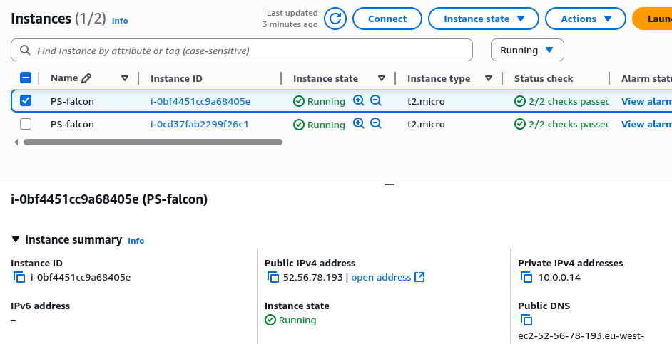
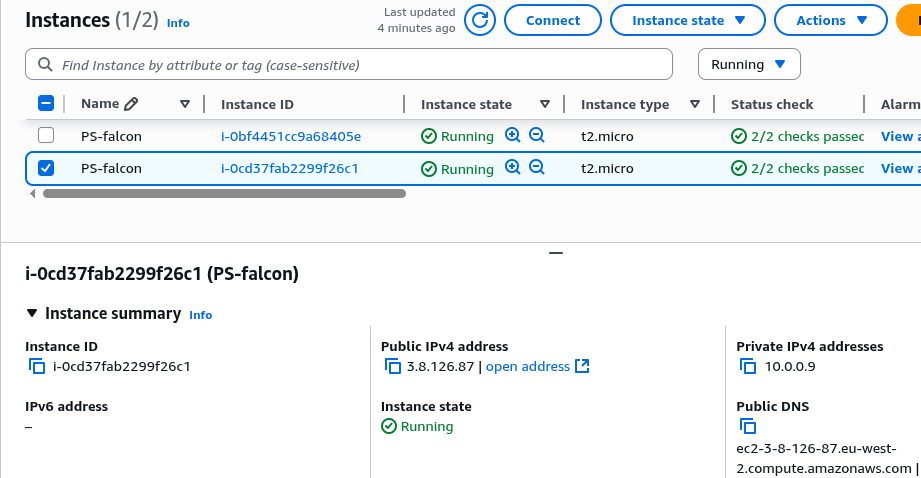
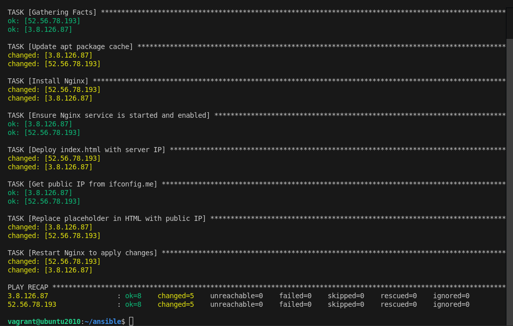
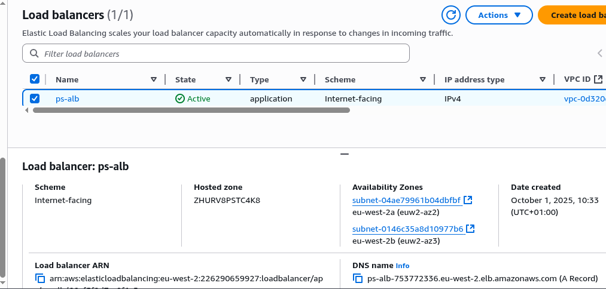
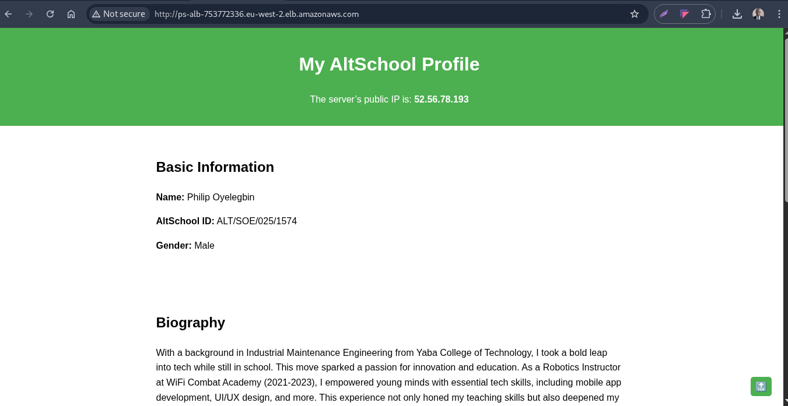
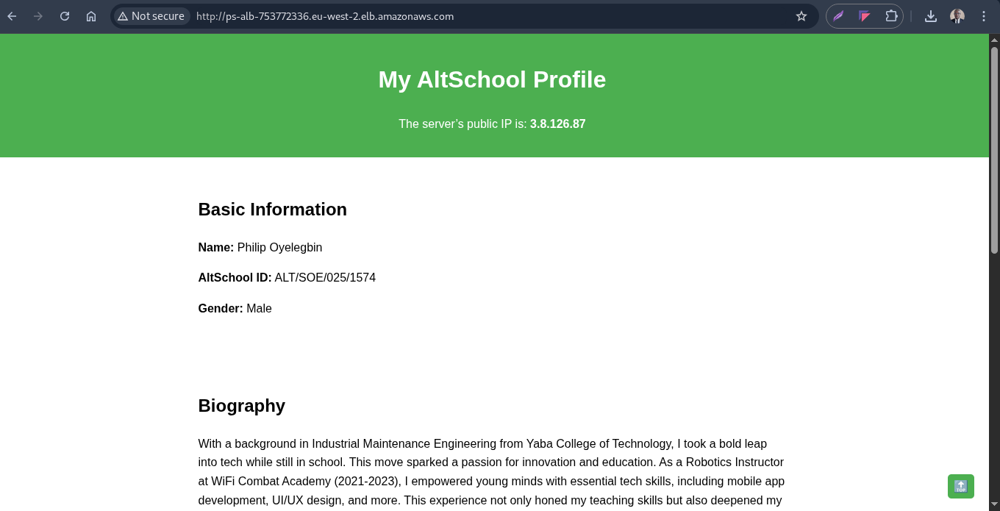
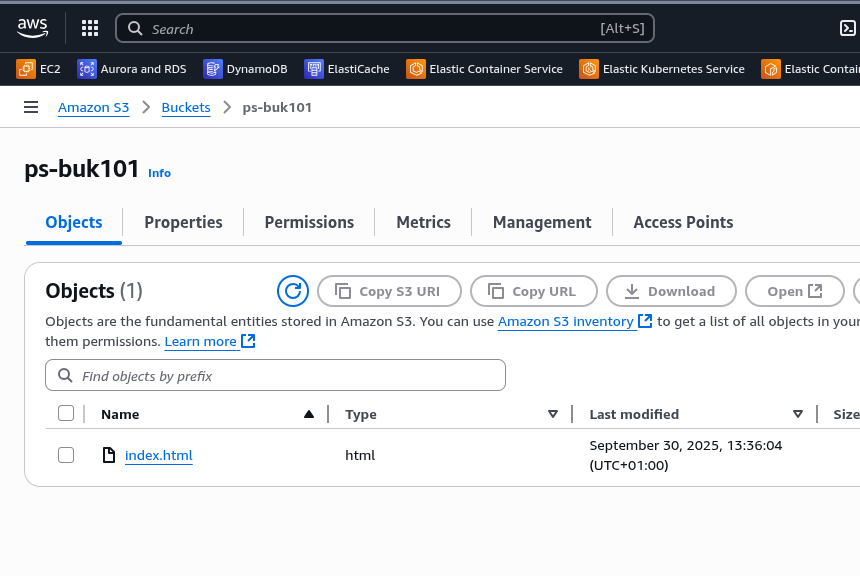
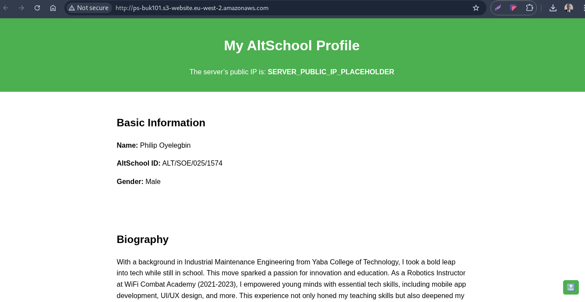

# ✨ 2nd Semester Final Examination

You are required to perform the following tasks

1. Launch 2 EC2 instances on AWS (Stay on Free Tier). — 10%

2. Clone a simple HTML page from any GitHub repository or create one yourself. Just make sure it displays the IP address of each instance it is uploaded to. You can fix this with any programming language. — 15%

3. Use Ansible from your local machine to Install NGINX as your webserver, ensure NGINX is started on boot, and deploy the HTML page on the EC2 instances. — 25%

4. Set up an ALB(Application Load balancer) to route requests to your EC2 instances. — 20%

5. Deploy the same HTML file to an S3 bucket as a static website and compare it with the EC2+ALB setup. This shows you the difference between compute-based hosting (EC2) and storage-based hosting (S3 Static Website Hosting). — 15%

6. Document your process using a Medium Article. All documents will be compared so do not plagiarise. This document will be the beginning of your writing and documentation journey. — 15%

---

## 🖊 Important points to note:

1. Any submission using direct EC2 public IPs will be considered incorrect. Even if your EC2 instances are assigned public IP addresses, you must not screenshot those IPs for testing. The screenshot must only show accessibility via the Application Load Balancer’s DNS name (or your custom domain if you set one up).

2. You should define a logical network on the cloud for your servers.

3. DELETE all resources after!

---

## 🚀 Result

1. Create 2 nginx server via the AWS console
   
   

2. Create an [inventory](./inventory.ini) file containing the nginx servers IP addresses.

3. Create the [index](./index.html) file needed to server static content on nginx servers.

4. Run the command `ansible-playbook -i inventory.ini --private-key=<key-name>.pem nginx-server.yml` to initiate the remote server configuration.

   

5. Create an applicaton load balancer for the nginx servers from AWS console as shown below.
   

6. Below is the snapshot of the rendered pages from different server via the application load balancer domain name.

   
   

7. Created an S3 bucket to server my static website and uplaoded the index.html file into the bucket via the console.
   

8. Snapshot of the same website via bucket static website url shwon below.
   
