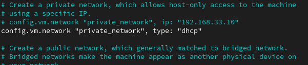
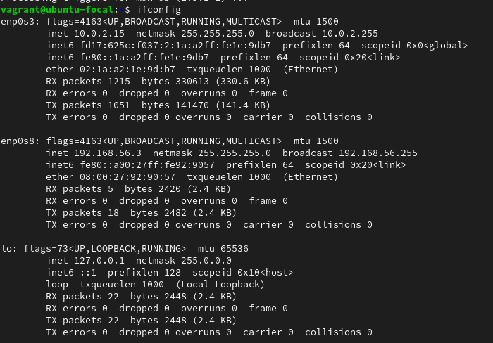

# Exercise 1

**Task:** Setup Ubuntu 20.04 LTS on your local machine using Vagrant

**Instruction:**

Customize your Vagrantfile as necessary with private_network set to dhcp
Once the machine is up, run ifconfig and share the output in your submission along with your Vagrantfile in a folder for this exercise.

**Result:**

- I created a folder for my ubuntu server
- I initiallized the folder with the Vagrant configuration file and a box.
- I updated the vagrant file with the code `config.vm.network "private_network", type: "dhcp"` as seen below.

- I ssh into the ubuntu server after starting up the server and ran the command `ifconfig` after installing the net-tool, result of the command is shown below.

