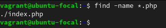
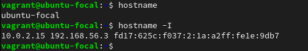

# Exercise 2

**Task:** Research online for 10 more linux commands aside the ones already mentioned in this module. Submit using your altschool-cloud-exercises project, explaining what each command is used for with examples of how to use each and example screenshots of using each of them.

**Instruction:** Submit your work in a folder for this exercise in your altschool-cloud-exercises project. You will need to learn how to embed images in markdown files.

**Result:**

- grep: is used to print lines that match the given patterns (e.g `ls grep *.ini`).

- systemctl: is used to control the systemd system and service manager (e.g `stystemctl status agache2`).

- crontab: is used to maintain crontab files for individual users (e.g `crontab -e`).

- host: is used to lookup the DNS of a domain name (e.g `host cisco.com`).

- find: is used to search for files in a directory hierarchy (e.g `find -name *.ini`).

- uptime: this shows how long the system has been running (e.g `uptime`).

- ping: this sends an ICMP ECHO_REQUEST to network hosts (e.g `ping -c3 cisco.com`).

- whoami: this prints the user name associated with the current effective user ID (e.g `whoami`).

- hostname: is used to display the system's DNS name, and to display or set its hostname or NIS domain name (e.g `hostname`).

- which: it is used to locate a command (e.g `which bash`).

