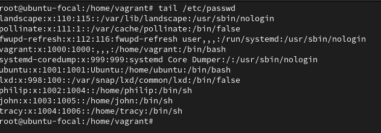

# Exercise 3

- Create 3 groups – admin, support & engineering and add the admin group to sudoers.
- Create a user in each of the groups.
- Generate SSH keys for the user in the admin group

**Instruction:**

Submit the contents of /etc/passwd, /etc/group, /etc/sudoers

**Result:**

- I noticed the group admin is an existing group, hence I created 2 groups – support & engineering and using the command `groupadd "group_name"`.

- I added the admin group to sudoers using the command `visudo` as a root user.

- I created the user (philip, john and tracy) using the command `useradd "user_name"` and assign them to groups using the command `usermod -G "group_name" "user_name"` as seen below.

- I loggedin to the "philip" user using the command `sudo login philip` to generated an SSH keys for philip using the command `sudo ssh-keygen` who is assigned to the admin group.

- Below are the file links to the contents of /etc/passwd, /etc/group, /etc/sudoers
  - [passwd](./passwd.txt)
  - [group](./group.txt)
  - [sudoers](./sudoer.txt)
