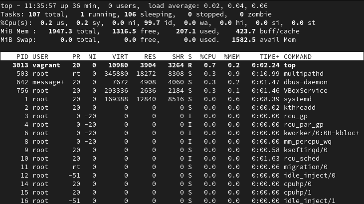
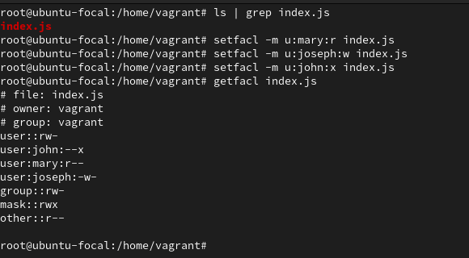

# Exercise 4

Dear AltSchooler! This is a Graded Assignment.
Make sure to upload/embed your answers and screenshots in your Google Doc or Word document before uploading the final document for submission. Just one document is required for the submission. Good luck!

**Instruction:**

1. Find out the command for checking running processes on your terminal. List out any five processes you see and what they do for your system.
   Your opinion on if they are important processes.
2. Create three users — Mary, Joseph, and John on your Linux system.
   Then create a file — index.js (you can use placeholder texts in the file or any other content, very short).
   Give each user different privileges/permissions to the file. (Read, Write, Execute).

**Result:**

1. The comand for checking running process is `top`. Below is the list of 5 running processes on my system as seen in the snapshot below.

- `systemd`: This is one of the most fundamental and critical processes on modern Linux distributions, including AlmaLinux 9. It's often referred to as the "init system" or "system and service manager". When a Linux kernel boots up, after initializing hardware, it hands off control to the very first user-space process.
- `kworker`: This are generic kernel worker threads. They are a fundamental part of the Linux kernel's internal workings, and their primary purpose is to execute deferred work within the kernel. It is responsible for handling kernel tasks
- `dbus-daemon`: This is the D-Bus message bus daemon. It's a critical component in modern Linux systems, especially those with graphical desktop environments like GNOME or KDE, but it's also used heavily by system services.
- `rcu_gp`: This is a kernel thread that is an integral part of the Read-Copy Update (RCU) synchronization mechanism in the Linux kernel. RCU is a highly optimized synchronization primitive used extensively within the Linux kernel, especially for data structures that are frequently read but rarely updated. It's designed to allow multiple readers to access data concurrently without locking, while still providing a way for updates to happen safely.
- `multipathd`: This is a daemon that is a crucial component of Linux Device Mapper Multipath (DM-Multipath). Its primary role is to manage and monitor multiple I/O (Input/Output) paths to storage devices, providing fault tolerance and performance enhancement.

2. I created the users Mary, Joseph, and John with a placeholder file index.js and gave each users permissions to the file using access control list as seen in the snapshot provided below.
   
