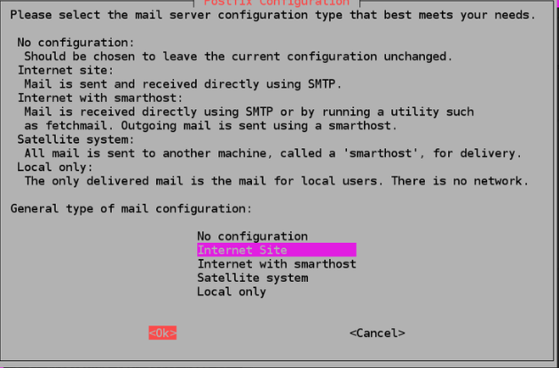
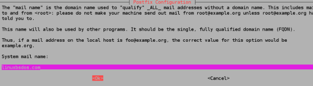
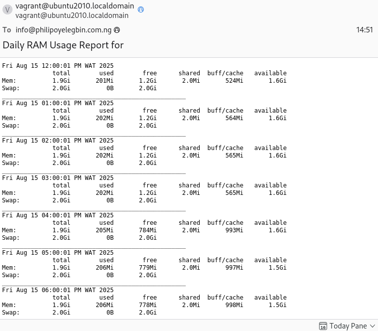

# ✨ Exercise 5

Create a bash script to run at every hour, saving system memory (RAM) usage to a specified file and at midnight it sends the content of the file to a specified email address, then starts over for the new day.

## 🖊 Instruction

- Submit the content of your script, cronjob and a sample of the email sent, all in the folder for this exercise.

## 🚀 Result

1. Created a bash script to automate the memory usage log and report [memory_log script](./memory_log.sh).

2. Setup cronjob to schedule the task [cronjob content](./crontab).

3. Installed and cofigure postfix as send only smtp server using the steps below;

   - Update the package database `sudo apt-get update`
   - Installing mailutils will install Postfix as well as a few other programs needed for Postfix to function. `sudo apt install mailutils -y`
   - Select "internet-site" in the configuratin window and click "Ok" as seen below
     
   - Update the system mail name to "localhost.com" or leave the default value.
     
   - Edit the file "main.cf" to configure postfix `sudo nano /etc/postfix/main.cf`
   - Find and update the following details as seen below

   ```
   inet_interfaces = loopback-only

   # add your hostname to the list of the destination below, mine is "ubuntu2010.localdomain"
   mydestination = $myhostname, ubuntu2010.localdomain, localhost.$mydomain, $mydomain
   ```

   - Save and restart postfix `sudo systemctl restart postfix`
   - Run a test using your email, I recommend using a cpanel/professional webmail, gmail might not work

   ```
   echo "The mail is working" | mail -s "PostFix Mail Test" your_email_address
   ```

4. Set the server timezone to my local timezone using the command `sudo timedatectl set-timezone Africa/Lagos`

5. Below is the image of the mail received
   

## 📑 Resources Used

- [DigitalOcean](https://www.digitalocean.com/community/tutorials/how-to-install-and-configure-postfix-as-a-send-only-smtp-server-on-ubuntu-16-04)
