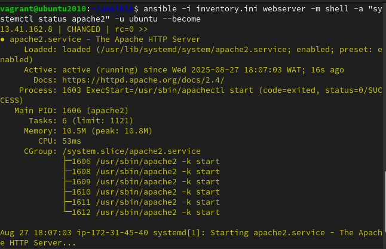
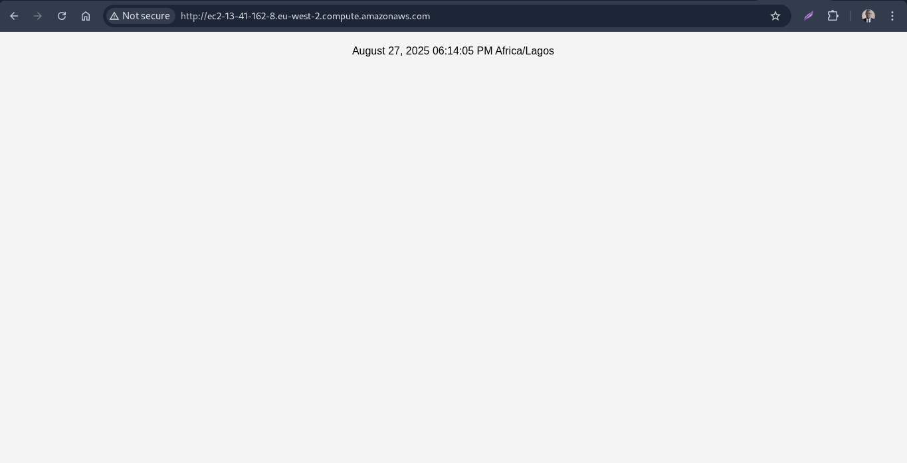

# ✨ Exercise 6

Create an Ansible Playbook to setup a server with Apache. The server should be set to the Africa/Lagos Timezone

Host an index.php file with the following content, as the main file on the server:

```
<?php
  echo date("F d, Y h:i:s A e", time());
?>
```

## 🖊 Instruction

- Submit the Ansible playbook, the output of systemctl status apache2 after deploying the playbook and a screenshot of the rendered page.

## 🚀 Result

1. Setup a remote server on AWS and added my public key to te server for authorization

2. Created an [inventory](./inventory.ini) file containing my remote web server IP address

3. Wrote an [ansible playbook](./setup_apache_php.yml) script to configure my remote server.

4. Created the [index](./index.php) web file needed to be copied to remote server.

5. Ran the command `ansible-playbook -i inventory.ini setup_apache_php.yml` to initiate the remote server configuration.

6. Used the command `ansible -i inventory.ini webserver -m shell -a "systemctl status apache2" -u vagrant --become` to get the output of systemctl status apache2 after deploying the playbook.

   

7. Below is the image of the rendered page

   
