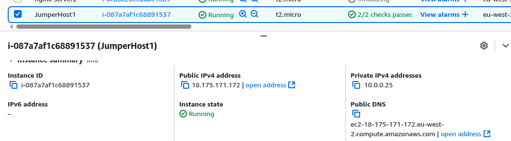
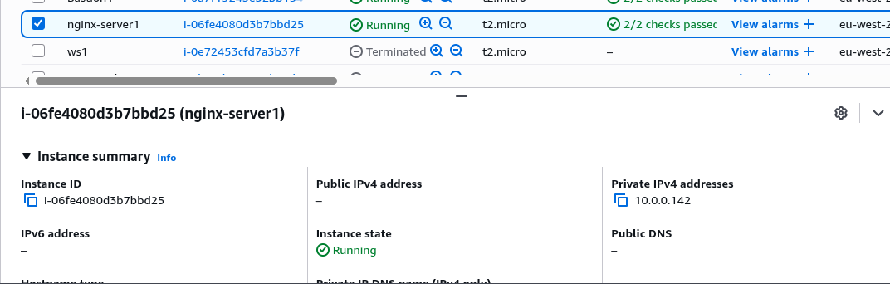
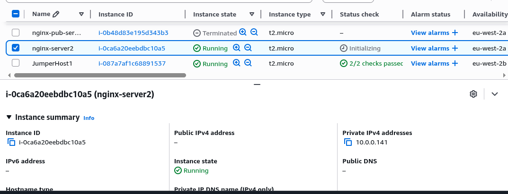
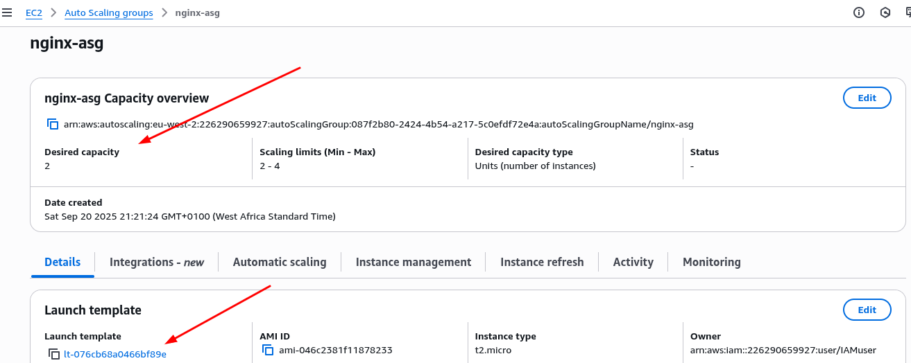
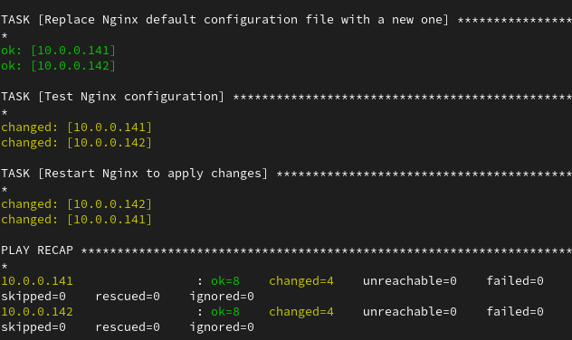
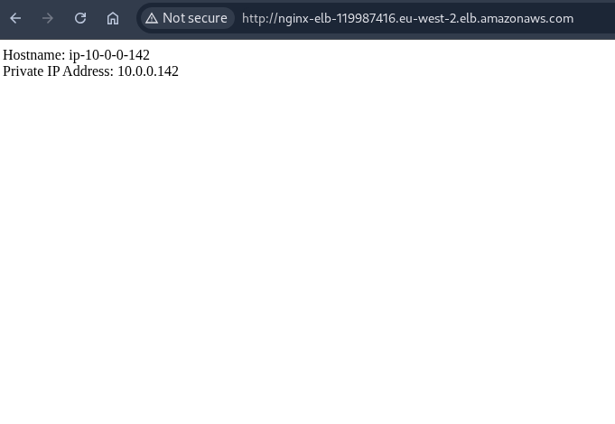
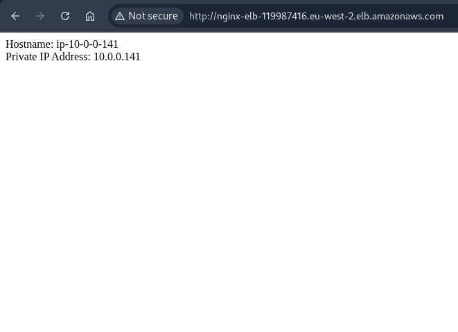

# ✨ Exercise 8

You are required to perform the following tasks

1. Set up 2 EC2 instances on AWS(use the free tier instances).
2. Deploy an Nginx web server on these instances(you are free to use Ansible)
3. Set up an ALB(Application Load balancer) to route requests to your EC2 instances
4. Make sure that each server displays its own Hostname or IP address. You can use any programming language of your choice to display this.
5. Work on building a personal portfolio and CV (Check out resumeworded.com).

## 🖊 Important points to note:

1. I should not be able to access your web servers through their respective IP addresses. Access must be only via the load balancer
2. You should define a logical network on the cloud for your servers.
3. Your EC2 instances must be launched in a private network.
4. Your Instances should not be assigned public IP addresses.
5. You may or may not set up auto scaling(I advice you do for knowledge sake)
6. You must submit a custom domain name(from a domain provider e.g. Route53) or the ALB’s domain name.

## 🚀 Result

1. Create a jump host called JumperHost1 on AWS and copy the private key to the jump host from local manchine to connect to the nginx servers using the command below
   `scp -i '<key-name>.pem' /path/<key-name>.pem ubuntu@<jumphost-ip>:/home/ubuntu/`
   

2. Create 2 nginx server in a private network and a load balancer for http access.
   
   

3. Create an [inventory](./inventory.ini) file containing the nginx server private IP addresses.

4. Install ansible on the jumperhost and write an [ansible playbook](./nginx-server.yml) script to configure both nginx servers.

5. Create the [index](./index.php) web file needed to be copied to nginx server.

6. Create the [default](./nginx-default) configuration file needed to replace the default nginx configuration.

7. Create a launch template to setup the auto scaling group
   

8. Run the command `ansible-playbook -i inventory.ini --private-key=<key-name>.pem nginx-server.yml` from the jumperhost to initiate the remote server configuration.

   

9. Below is the image of the rendered pages from different server via the load balancer domain name (http://nginx-elb-119987416.eu-west-2.elb.amazonaws.com).

   
   
